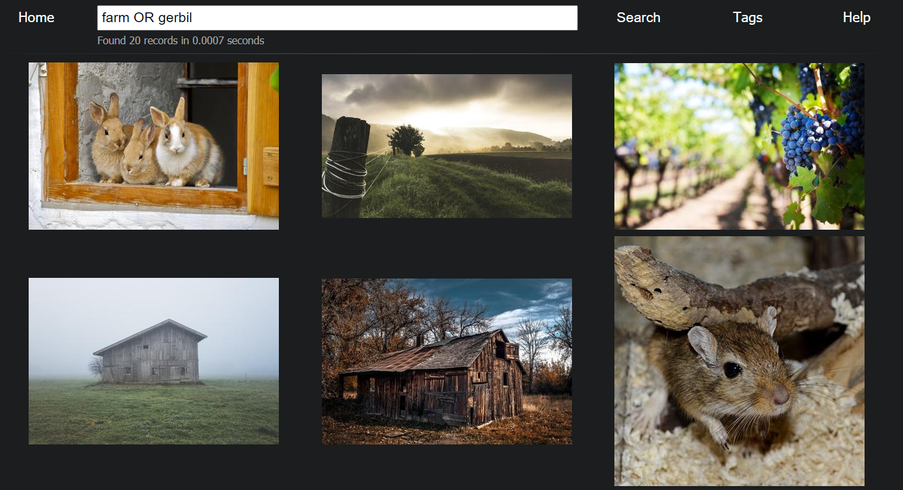

# MediaStorageSystem

Store media materials, search by tags, browse content.



**Currently adding is not yet implemented, so archive is read only.**

**Current version works only with images.**

**Current version does not checks for duplicates.**

### Browser

Allows you to browse what is inside the archive. Built as a web application,
deployable as a web server, but can also run locally. Regular python flask
based application.

### Placement of components

Gathered media files are supposed to be packed into a single zip file and
shipped this way. No program components (like browser) are supposed to be
included into the package. All tools are to be placed near content manually.
After downloading, contents must be unpacked.

Resulting folder structure must look something like this:

```
my_archive
├── Description.md
├── <version file>
├── cats
│   ├── metainfo
│   │   └── ...
│   ├── previews
│   │   └── ...
│   ├── thumbnails
│   │   └── ...
│   ├── images
│   │   └── ...
│   ├── theme.yaml
│   └── used_uuids.csv
│
└── dogs
    ├── metainfo
    │   └── ...
    ├── previews
    │   └── ...
    ├── thumbnails
    │   └── ...
    ├── images
    │   └── ...
    ├── theme.yaml
    └── used_uuids.csv
```

Where "cats" and "dogs" are your corresponding themes.

### Search engine

You can use logical keywords to perform search, such as: AND, OR and NOT.
Exactly uppercase. Search is not working for spelling mistakes. Your request
must match tag exactly. Anything, except keywords, is converted to lowercase
during processing.

Meanings are:

* AND - record is included only if text is present in at least one tag.
* OR - record is included if text is present, but other keywords might change
  it.
* NOT - record is excluded if text is found in any tag.

Query will be split into series of pairs keyword+text. If your request does not
start from keyword, system will automatically add AND at the start. So "cats
AND dogs NOT frogs" will be turned into "AND cats AND dogs NOT frogs". As a
result, human readable form of this request is: "show me all records, that
specifically have tag 'dogs' and optionally have tag 'cats', but definitely do
not have tag 'frogs'".

Do not think of the query as of logical rule. Each keyword is treated
separately. You cannot use queries like "cats AND NOT dogs".

### Themes

Themes are constructed from folders in base folder. 
Each "theme" is representing some, well, theme and makes it possible to 
distinguish between them. Once you got inside theme, system will try to keep 
you inside. You can change themes on the Tags tab. You also can use 
keywords to alter search results without actually changing your current theme.

Meanings are:

* INCLUDE - record is included only if its theme is the same as in user request.
* EXCLUDE - record is excluded if its theme is the same as in user request. 

Note that themes are separate from tags. Even if they have the same name, 
search will be performed separately. You also cas use these keywords multiple times.

For example:

> cats AND dogs INCLUDE mammals INCLUDE toys EXCLUDE sports

**Currently you need to specify directory name, not actually theme name.**

### Special keywords

For images:

* TINY - only tiny images.
* SMALL - only small images.
* MEAN - only regular size images.
* BIG - only big images.
* HUGE - only huge images.

For video/audion or animated images:

* MOMENT - only super short duration.
* SHORT - only short duration.
* MEDIUM - only medium length duration.
* LONG - only long duration.

For specific media type:

* IMAGE - only static images.
* GIF - only animated images.
* VIDEO - only video files.
* AUDIO - only audio files.

Other:

* DESC - show found records in reverse order.
* DEMAND - force showing hidden tags.

For example: 

> dragons AND SHORT AND DESC

Logical keywords do not matter here, AND will always be used.

### Synonyms

Since you have to match tags literally, soon it becomes tedious to write search
requests. Synonyms are here to help you! In each theme there is a file called
"theme.yaml" with a section called "Synonyms". There you can write down
replacements you'd like to use. Everything in given list of words will be
treated equally. Key is a comment and value is an array of tags.

Example:

```yaml
synonyms:
    "If user wants to find cats":
        - cat
        - kitty
        - kitten
    "If user wants to find dogs":
        - dog
        - puppy
        - doggie
```

### Tags on demand

Sometimes you don't want something to be shown during regular search. Like
things not really appropriate, or something you specifically do not like. You
can describe such things in a section called "tags_on_demand" in "theme.yaml".

Tags in this list will be shown only if they were specifically included in
search request. Synonyms are not applied to these tags. Syntax is similar to
synonyms.

Example:

```yaml
tags_on_demand:
    "Some users do not like spiders":
        - spider
        - arachnids
        - arachnid
```

### Code injection

You can add text file called "injection.html" to the browser folder. Everything
from this file will be added at the bottom of every rendered page, without
escaping, before the end of the "body" tag. This feature is added for you to be
able to include external metrics/features, that require adding some HTML/JS 
code to your page.


